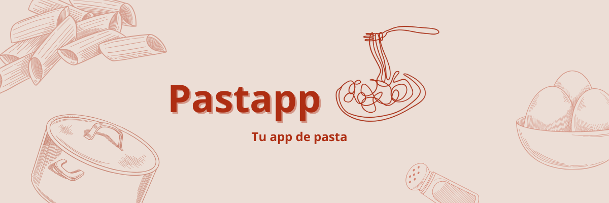

<p align="center">
  
</p>

# Pastapp

[](https://angular.io/)  
[](https://rxjs.dev/)  
[](https://www.typescriptlang.org/)  
[](https://sass-lang.com/)  
[](https://material.angular.io/)  

A simple **Angular CLI** application built as part of my frontend portfolio.  
The project demonstrates **clean architecture**, **modular structure**, **reusable UI components**, and **reactive state management with RxJS**.  

---

## ⚙️ Setup & Run  

1. Clone the repository:  
   ```bash
   git clone https://github.com/your-username/angular-recipes-portfolio.git
   cd angular-recipes-portfolio
   
2. Install dependencies:  
   ```bash
   npm install
   
3. Run the development server:  
   ```bash
    ng serve
  
4. Open in your browser:  
   ```bash
    http://localhost:4200

## 🛠️ Tools & Libraries  

- [Angular CLI](https://angular.io/cli) – Project scaffolding and build  
- [RxJS](https://rxjs.dev/) – Reactive state management  
- [TypeScript](https://www.typescriptlang.org/) – Type-safe development  
- [Angular Material](https://material.angular.io/) – UI components  
- [SCSS](https://sass-lang.com/) – Styling with modular approach  
- **LocalStorage API** – Recipe persistence  

---

## 📐 Design Decisions & Assumptions  

- **Modular structure**  
  - `core` → app-wide singletons (layout, services)  
  - `recipes` → feature-based modules with encapsulated UI + logic  
  - `shared` → reusable UI and entities  

- **State management**  
  Used `BehaviorSubject` in `RecipeService` instead of a full NgRx setup, since the app is small. This provides a simple but fully reactive state solution.  

- **Persistence**  
  Recipes are stored in `localStorage`. A mock dataset (`RECIPES_MOCK`) is used as the initial data.  

- **Styling**  
  Built mainly with custom **SCSS** styles and some **Angular Material** components for consistency and accessibility.  

- **UI components**  
  Created generic `Card`, `Modal`, and `Button` components in `shared/ui` to ensure design consistency and reusability across features.  

- **Scalability**  
  The feature-based folder structure under `recipes/` makes it easy to extend the application with new modules and UI components in the future.  

---

👉 This project is part of my **Frontend Portfolio**.  
It highlights **clean Angular architecture**, **component-driven development**, and **RxJS patterns**, combined with **SCSS** and **Angular Material** for a modern UI.  

---
